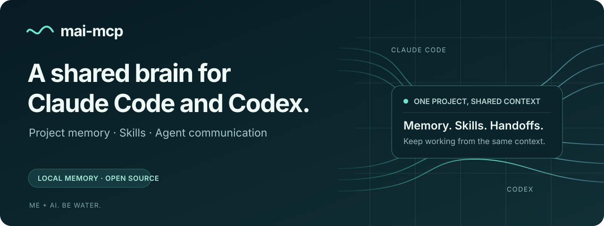

<!-- onboarding:start -->
<p align="center">
  
</p>

<p align="center">
  <a href="https://www.npmjs.com/package/mai-mcp"></a>
  <a href="https://github.com/maikai-group/mai-mcp/actions/workflows/platform.yml"></a>
  <a href="LICENSE"></a>
  <a href="#quickstart"></a>
</p>

# Project memory for your coding agents

**Keep the decisions, lessons, and code context that make the next session better.**
mai-mcp gives Claude Code and Codex a shared, persistent project memory through the
[Model Context Protocol](https://modelcontextprotocol.io/). Switch sessions or
agents without starting the explanation over.

Your memory lives in a local PostgreSQL database. Search it, inspect it in the
dashboard, and decide what is worth keeping. **Free and open source. MIT licensed.**

[Get started](#quickstart) · [What you can do](#what-you-can-do) · [See the dashboard](#see-your-projects-memory) · [Documentation](#learn-more)

## Quickstart

**Have Node 24, Git, and Docker Desktop installed, with Docker running.**
Open a terminal in the project you want your agent to remember, then run:

```bash
npx mai-mcp setup
```

Follow the guided setup to choose the install location and connect Claude Code,
Codex, or both. Setup starts the database, applies the schema, and installs the
MCP wiring, capture hooks, and skills. **Restart your coding agent when it finishes.**

Try this in your next session:

> Prime this project, inspect the code graph, and tell me what context is available.

A new brain starts without your past decisions. As you work, ask your agent to
record the choices and lessons you want future sessions to use.

**macOS and Linux supported. Native Windows 11 is preview.**
See [platform support](#platform-support) for Windows and WSL2 instructions.
Already cloned the repository? Run `npm run setup` from the checkout.

## What you can do

| When you need to… | mai gives your agent… |
|---|---|
| Pick up work in a fresh session | Project context, recorded decisions, lessons, and recent activity. |
| Understand why something was built that way | Searchable decisions and their rationale, with links to related work. |
| Investigate a change | A code graph of functions, classes, routes, and dependencies; optional database schema links. |
| Avoid repeating a mistake | Durable lessons that can be recalled and attached to relevant code. |
| Move between Claude Code and Codex | Access to the same project memory, with wiring for both clients. |
| Review what has accumulated | A local dashboard for search, timelines, the code graph, and memory curation. |

### Questions worth trying

Ask your coding agent in ordinary language:

- “What did we decide about authentication, and why?”
- “What depends on this function?”
- “Have we run into this problem before?”
- “Record this tradeoff so we remember it next time.”

Answers depend on what has been captured and indexed in your project. The brain
stores useful context; your agent still checks the current code.

## How it fits into your workflow

1. **Connect your project.** Setup registers the MCP server and installs the
   rules, hooks, and skills for your selected clients.
2. **Build up memory while you work.** Agents search before recording durable
   decisions and lessons. Capture hooks ingest session history; optional model
   providers can add summaries and candidate decisions.
3. **Carry useful context forward.** Start the next session with `mai_prime`,
   search the brain as questions arise, and use the dashboard to review it.

Each MCP server is pinned to one project. A single installation can serve
multiple projects, with separate project context and explicit, opt-in sharing.

## See your project's memory

The local dashboard makes the brain visible: explore the code graph, search
memory, review lessons, and follow your project's timeline.


Start it from a terminal after setup:

```bash
mai dashboard start
```

Open the local URL printed by the command. The dashboard is optional and does
not start automatically during setup. [Dashboard guide](docs/configuration.md#dashboard).

## Your data, your choices

- **Local storage.** Project memory is stored in your PostgreSQL database.
  Default setup binds the database to your machine's loopback interface.
- **No extra API key required for core memory.** Search, the code graph, and
  local embeddings can run without a cloud API key. Local embeddings require
  an initial model download.
- **Optional model features.** Summaries and automatic candidate-decision
  extraction use a configured provider. Claude Code and Codex subscription
  providers are available alongside API providers.
- **You choose what leaves your machine.** Cloud providers and your coding
  agent have their own data handling and pricing. Local storage does not make
  a cloud coding session offline.

[Provider configuration](docs/configuration.md#providers--bring-your-own-model) · [Security policy](SECURITY.md)

## Platform support

| Environment | Support | Proof |
|---|---|---|
| macOS | First-class | CI + release gates |
| Linux | First-class | CI + release gates |
| Windows 11 (native PowerShell) | Preview | Windows CI; full interactive acceptance pending |
| Windows 11 (WSL2) | First-class Linux mode | Linux path; not native-Windows evidence |
| Windows 10 | Best effort | Not launch-certified yet |

<details>
<summary>Windows and WSL2 setup details</summary>

Windows launch gate: preview — physical acceptance deferred

Vendor claims re-read 2026-09-13. [Claude Code setup](https://code.claude.com/docs/en/setup):
native Windows requires no dependency, Git for Windows is optional and enables
the Bash tool, WSL 2 is a distinct path. [Codex CLI](https://learn.chatgpt.com/docs/codex/cli)
and [Codex on WSL](https://learn.chatgpt.com/docs/windows/wsl): WSL2 is a
distinct Linux-mode option beside the native Windows sandbox; WSL1 is
unsupported since Codex 0.115.

### Native Windows 11 quickstart

Native Windows is a preview in v1.0. Automated Windows CI passes; full
installation, harness capture and sign-out/sign-in acceptance is still pending.

Prerequisites: Node 24; **Git for Windows** — required by mai-mcp's installer,
which clones the runtime (Claude Code itself treats it as optional and falls
back to its PowerShell tool); Docker Desktop with Linux containers; PowerShell
5.1+; Claude Code; Codex in its vendor-supported native-Windows form. Run from
the project you want onboarded, in PowerShell:

```powershell
npx mai-mcp setup --yes -- --slug my-project --root $PWD.Path --harness all
```

### WSL2 quickstart

WSL2 is a separate Linux-mode path: open your WSL distribution and follow the
Linux quickstart inside the Linux filesystem (`/home/...`). Do not mix a
Windows checkout path (`/mnt/c/...`) with WSL state — the brain checkout, the
hooks and the Docker socket must all live on the same side.


</details>

## Who it is for

Developers working on projects that outlast a single chat: ongoing products,
multiple repositories, or work that moves between coding agents. Start with one
project and let useful memory build up alongside the code.

## What setup changes

<details>
<summary>See what the installer configures on your machine</summary>


- Creates (or reuses) a **visible clone** of this repository at a location you
  choose (`~/mai-mcp` by default); all brain state lives in that clone, never
  in an npm cache.
- Starts a **loopback Docker Postgres** (`127.0.0.1:54334`), creates the
  `mai_brain` database, and applies the schema plus every forward migration.
- Wires the repository you ran it from: MCP server registration, capture
  hooks, and the memory-brain rules block for each selected harness.
- Installs the **complete skill and reviewer-agent suite** to every detected
  harness destination (`mai skills install` refreshes them any time; if your
  harness shows stale tools afterwards, restart it).
- Does **not** start the dashboard automatically — the summary offers ordinary
  startup and an opt-in login-persistence command on macOS and Windows.
- Ends with verification and tells you to **restart Claude Code or Codex** so
  the new wiring loads. Re-running setup is safe and idempotent; `--update`
  pulls the latest checkout first.

### Adding another harness to an existing project

Projects onboarded before both harnesses were enabled keep their existing
wiring. `mai upgrade` refreshes installed wiring but deliberately does not add
a missing harness. Add it once with `mai init`, then restart that client:

```bash
mai init <slug> --root <project-root> --harness codex
# or: mai init <slug> --root <project-root> --harness claude-code
```

The command is additive: it preserves the project's current harnesses and
installs the newly selected one. Run `mai verify <slug>` afterwards.


</details>

## Learn more

- [Configuration reference](docs/configuration.md) — every environment
  variable, provider choice, manual/advanced setup, verification and upgrades.
- [Architecture](docs/architecture.md) — the write-gate, capture tiers, code
  graph, git evidence, curation loops, and the coordination layer.
- [Lessons on graph nodes](docs/architecture.md#lessons-on-graph-nodes) — attach
  learned advice to code, with dashboard, CLI, agent and upgrade instructions.
- [Harness wiring](docs/harnesses.md) — Claude Code, Codex and generic MCP
  registration, hooks, named profiles for multiple Codex accounts, skill
  targets/scopes, and multi-repo layouts.
<!-- dashboard-launcher:start -->
- [Dashboard and review usage](docs/configuration.md#dashboard) — the local
  web UI for triage, search, roadmap, and the interactive code graph. Normal
  starts are detached with `mai dashboard start`; Codex, CI, and retained
  runners can use `mai dashboard run`. For login persistence, run
  `bash scripts/mai-brain-web-launchd.sh install` on macOS or
  `scripts/windows/install-dashboard.ps1 -Action Install -CheckoutRoot <absolute path>`
  in PowerShell on Windows.
<!-- dashboard-launcher:end -->
- [Cross-project references](docs/configuration.md#cross-project-references-operator-only) —
  opt-in, read-only sharing between two separate products' brains: `mai link`
  plus `mai share`, one item at a time, revocable and audited.
- [Security policy][security] · [Contributing][contributing] · [MIT license][license]

## Help shape mai

Trying mai on a real project is the most useful feedback you can give us.
[Report a bug or request a feature](https://github.com/maikai-group/mai-mcp/issues)
with your OS, coding client, what you expected, and what happened. Remove
credentials and private project data from anything you share.

Want to contribute? Start with the [contributing guide](CONTRIBUTING.md).
If mai helps your workflow, a GitHub star helps other developers find it.

---

**mai = me + AI.** Sessions change. Useful knowledge stays.

Built by [Maikai Group](https://github.com/maikai-group). Be water, mai friend.
<!-- onboarding:end -->

[security]: SECURITY.md
[contributing]: CONTRIBUTING.md
[license]: LICENSE
