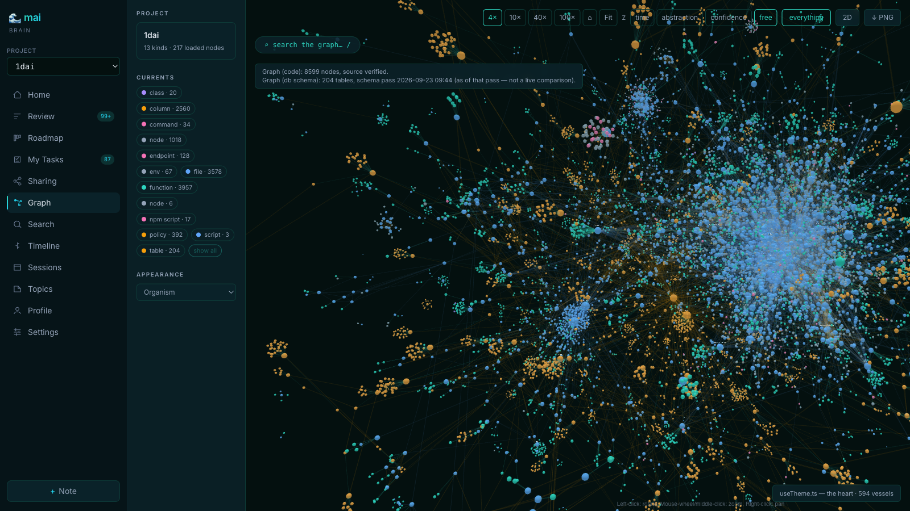

<!-- onboarding:start -->
<p align="center">
  
</p>

<p align="center">
  <a href="https://www.npmjs.com/package/mai-mcp"></a>
  <a href="https://github.com/maikai-group/mai-mcp/actions/workflows/platform.yml"></a>
  <a href="LICENSE"></a>
  <a href="#quickstart"></a>
</p>

# mai-mcp

**Persistent, local memory for Claude Code and Codex. An MCP server that gives
your coding agents a brain that lives on your machine, remembers every project,
and is shared by both clients.**

Every new chat starts from zero. You re-explain the architecture, the agent
re-discovers the bug you fixed last week, and the decision you argued about for
an hour is gone the moment the context window fills. If you run Claude and Codex
side by side, you become the courier, pasting one agent's answer into the other.

mai fixes that. Your agents prime from the brain at the start of every session,
search it before they decide anything, and write back what they decided and why.
The next session, in either client, picks up exactly where the last one stopped.

- **Local and private.** A PostgreSQL database bound to loopback on your machine.
  No hosted service, no account, no telemetry. We never see your code or your
  conversations, because there is nowhere for them to go.
- **Substantial.** 48 MCP tools, 21 workflow skills, a code graph of your repos
  across 12 languages, git evidence, a shared agent board, and a local dashboard.
  Not a notes file.
- **Self-curating.** Writes go through a gate: search first, cite what you build on
  or replace. Contradictions surface instead of piling up.
- **Free and open.** MIT. One install serves every project you have.



[Get started](#quickstart) · [Why local](#your-data-stays-yours) · [What's inside](#whats-inside) · [Agents working together](#claude-and-codex-working-together) · [Skills](#skills-for-the-whole-job) · [Docs](#learn-more)

## What a session looks like

Your agent opens a chat. Before you type anything, the brain has already primed it:

```text
# mai-prime — project 'my-app'

## Recent activity
- 2026-09-22 23:10  decision — Move rate limiting into the edge worker; app-level
  limiter double-counted retried requests.
- 2026-09-22 21:04  session — Fixed flaky checkout test; root cause was a shared
  fixture, not the payment mock.

## Agent board — 1 open item
- handoff from codex: "Auth refactor is on branch auth-v2. Review the token
  rotation path before merging."

## Prior decisions + lessons relevant to your task
- [architecture] Sessions are stored in Postgres, not Redis; Redis is cache only.
- lesson: Never mock the payment client at module scope; it leaks across tests.

## Structure relevant to your task
- [function] src/auth/rotateToken.ts:rotateToken  →  called by 3 routes
```

Then, while it works, the agent searches before deciding, records what it chose
and the options it rejected, and leaves a note for the next session or the other
client. You stop repeating yourself. Both agents stop repeating each other.

## How it compares

| | Rules file (CLAUDE.md, AGENTS.md) | Hosted memory service | Notes vault plugin | mai |
|---|---|---|---|---|
| Remembers decisions and why | You type them by hand | Yes | You type them by hand | Yes, agents write them with citations |
| Knows your code structure | No | Sometimes | No | Code graph, 12 languages, plus DB schema |
| Shared by Claude Code and Codex | Separate files | Depends | No | One brain, one board |
| Where your data lives | Your repo | Their servers | Your files | Your machine, loopback only |
| Curates itself | No | Rarely | No | Write-gate, review queue, lesson graduation |
| Cost | Free | Subscription | Free or paid | Free, MIT |

A rules file is still useful. mai installs one for you, and it tells the agent
how to use the brain.

## Quickstart

**Have Node 24, Git, and Docker Desktop installed, with Docker running.**
Open a terminal in the project you want your agent to remember, then run:

```bash
npx mai-mcp setup
```

Setup asks where to install mai, detects your coding clients, and connects them.
It starts the database and installs the MCP connection, capture hooks, and skills.
**Restart Claude Code or Codex when it finishes.**

Try this in your next session:

> Read this project's memory and check the board for any handoffs before we start.

The memory builds up as you work. A fresh setup does not already know the history
of your project; ask your agent to record anything you want later sessions to use.

**macOS and Linux supported. Native Windows 11 is preview.**
See [platform support](#platform-support) for Windows and WSL2 instructions.
Already cloned the repository? Run `npm run setup` from the checkout.

## Your data stays yours

This is the part we care about most, so it gets its own section.

- **Nothing leaves your machine by default.** Memory lives in a Docker Postgres
  on `127.0.0.1:54334`. The dashboard binds to loopback only. There is no mai
  cloud, no sync, no usage reporting. We cannot see your data because there is
  nowhere for it to go.
- **No API key needed for the core.** Keyword search, semantic search, the code
  graph, git evidence, the board, and the skills all run keyless. Semantic search
  uses a small local embedding model (a one-time ~35 MB download) and embeds on
  your CPU.
- **Cloud models are opt-in, per feature.** Turn on a provider only if you want
  session summaries or automatic candidate-decision extraction. Saving a key never
  enables a feature by itself. Keys are encrypted at rest with the master key held
  in your OS credential store.
- **No hosted memory subscription.** You do not need a paid brain service or a
  vault you maintain by hand. The riverbed is a database you own, in a checkout
  you can read.
- **Your coding clients still work the way they always did.** Claude Code and
  Codex keep their own accounts, pricing, and data handling. mai sits beside them,
  not between you and them.

[Provider configuration](docs/configuration.md#providers--bring-your-own-model) · [Security policy](SECURITY.md)

## What's inside

mai is one MCP server, pinned to one project per connection, exposing 48 tools.
Here is the shape of it. The [architecture doc](docs/architecture.md) has the
detail behind each row.

| Layer | What it does | Tools |
|---|---|---|
| **Prime and recall** | Load the project briefing at session start: recent sessions, valid decisions, open board items, structure hits for the task at hand. | `mai_prime`, `mai_recall`, `mai_timeline`, `mai_topics`, `mai_get_context` |
| **Decisions and lessons** | Search before you write; log decisions with the alternatives considered; add durable lessons; link records to each other and to code. Every write carries a citation. | `mai_search`, `mai_remember`, `mai_lesson_add`, `mai_link`, `mai_edges`, `mai_retract`, `mai_unretract`, `mai_promote`, `mai_globalize` |
| **Session notes and progress** | Structured end-of-session notes and verified milestones, so the next agent knows what actually landed. | `mai_note`, `mai_progress`, `mai_report` |
| **Curation** | Review queue for agent-inferred entries, write-gate violations, and the loops that graduate repeated lessons into project rules. | `mai_review`, `mai_violations` |
| **Code graph** | Functions, classes, routes, modules, and database tables as one graph. Ask what calls what, trace a path, see the blast radius of a change, find dead-code candidates, check freshness. | `mai_graph_find`, `mai_graph_neighbors`, `mai_graph_trace`, `mai_graph_impact`, `mai_graph_query`, `mai_graph_dead_code`, `mai_graph_stale`, `mai_navigate` |
| **Git evidence** | Branches, worktrees, and commits in one call; bounded live diffs; trace a decision to the session, commits, and files that carried it out. | `mai_git_context`, `mai_git_show`, `mai_git_trace_decision` |
| **Agent board and claims** | Notes, questions, handoffs, and answers between agents. Claim the files you are about to edit so parallel agents get a warning. | `mai_board_read`, `mai_board_post`, `mai_claim`, `mai_claims` |
| **Plans, reviews, findings** | Register a plan, post review passes, file and close findings with stable IDs, and keep receipts of what ran. | `mai_plan`, `mai_review_post`, `mai_findings`, `mai_finding_update`, `mai_receipt_add`, `mai_receipts`, `mai_artifact_put` |
| **Roadmap and tasks** | Park ideas, move cards from planned to building to shipped with evidence, and hand the operator tasks that need a human. | `mai_idea`, `mai_ideas`, `mai_idea_move`, `mai_user_tasks`, `mai_user_tasks_post`, `mai_fact_add` |
| **Cross-project** | Opt-in, read-only, one item at a time: share a decision from one product's brain with another. Revocable and audited. | `mai_shared` |

Two properties hold across all of it:

- **Project pinning is absolute.** Each MCP connection serves exactly one project,
  set by the server's environment. No tool takes a project parameter, so an agent
  cannot wander into the wrong brain by mistake.
- **Every read is bounded.** Broad reads return headlines plus an exact recovery
  pointer, capped at 6,000 characters, so a memory lookup never floods the context
  window it was meant to save.

### Memory that curates itself

Decisions and lessons pass through a write-gate. The agent must have searched the
brain in this session, and the write must say whether it is `novel`, `extends`
an existing record, or `supersedes` one and why. That is what stops the brain from
becoming a pile of contradictory notes: a changed decision is recorded as a
supersession, not a second opinion. Agent-inferred entries land in a review queue
for you to promote or retire, and a lesson that keeps getting relearned is
proposed as a project rule.

### How sessions get captured

Claude Code uses native hooks: SessionStart primes the agent, SessionEnd ingests
the transcript, and a Stop nudge asks the agent to sweep for unlogged decisions.
Codex uses a notify chain that scans its rollout files. Any other MCP client gets
a rules-file block that teaches the agent to prime and search by hand.

## Claude and Codex working together

Both clients connect to the same project brain and the same board. Ask one agent
to leave work for the other and stop being the courier.

1. Ask Claude to investigate a bug and post its findings on the board.
2. Ask Codex to read that handoff, check the evidence, and make the fix.
3. Ask Claude to review the change. Its findings and the eventual resolution
   stay with the project.

Communication is asynchronous: an agent picks up updates when it reads the board
or primes the project. Board posts from other agents arrive marked as information
to evaluate, never as instructions to follow.

When agents work in parallel, they claim the files they intend to edit and get
warnings about overlapping work. Claims are advisory; use separate Git worktrees
when you need real file isolation.

[How the shared board works](docs/architecture.md#agent-board-mai_board_) · [Parallel-agent claims](docs/architecture.md#parallel-agent-claims-mai_claim--mai_claims)

## Code graph and dashboard

Tree-sitter extractors turn each repo into a graph: TypeScript and JavaScript,
Python, C++, PHP and WordPress hooks, Swift, Kotlin, Go, Rust, Java, C#, and
shell. Point it at a read-only PostgreSQL or MySQL dev database and the schema
joins the same graph, so "what code touches this table" is one query. The graph
tracks your working tree, not just HEAD, so staged edits are visible before you
commit. Lessons can be attached to graph nodes, so advice about a function shows
up when an agent looks at that function.

The dashboard (pictured above) lets you browse that graph, search memory, triage
the review queue, manage providers, and follow the project's timeline.

Start it from a terminal after setup:

```bash
mai dashboard start
```

Open the local URL printed by the command. The dashboard is optional and does
not start automatically during setup. [Dashboard guide](docs/configuration.md#dashboard).

## Skills for the whole job

mai ships 21 workflow skills that give agents a process to follow, from
investigating an unfamiliar codebase to verifying finished work. Every skill
reads and writes the project memory, so earlier findings and lessons are on the
table for the next task.

- **Explore and research:** trace the code and investigate technical questions
  against real project constraints.
- **Design and plan:** settle requirements into a spec, write a plan an agent with
  zero context can follow, and put it through independent review before anything
  is built.
- **Implement and coordinate:** execute the plan task by task, dispatch independent
  work to parallel subagents with claimed lanes, and audit fidelity to the plan.
- **Debug, test, and review:** investigate failures before proposing fixes, design
  verification matrices, review diffs, and track findings through to resolution.
- **Maintain the project:** sync docs to behavior, audit the skill suite, and turn
  reviewed lessons into guidance for future work.

Setup installs the skills for your selected clients. You can also
[install or update them separately](docs/harnesses.md#skills--install-targets-and-scopes).
The [skill files](skills/) are part of the repository and share one
[spine](skills/SPINE.md), so you can read exactly how each workflow works.

## Token discipline

A memory system that costs more context than it saves is not worth running, so
this gets measured.

- **Shipped:** every brain read is capped at 6,000 characters with an exact
  recovery pointer. Prime uses an adaptive budget so the briefing fits without
  dropping the parts that matter.
- **Shipped, measurement only:** an optional shadow hook records how much shorter
  a passing test result could have been, without changing what your agent sees.
  [Token shadow](docs/token-shadow.md).
- **In progress:** an opt-in tool-result wall. mai keeps the exact output of an
  eligible command locally, hands the agent a short summary plus a receipt, and
  the agent pages in only the lines it needs. Off and shadow modes stay
  byte-for-byte identical to today. This is designed and planned, not shipped, and
  no savings figure will be claimed without paired whole-task evidence.

## Platform support

| Environment | Support | Proof |
|---|---|---|
| macOS | First-class | CI + release gates |
| Linux | First-class | CI + release gates |
| Windows 11 (native PowerShell) | Preview | Windows CI; full interactive acceptance pending |
| Windows 11 (WSL2) | First-class Linux mode | Linux path; not native-Windows evidence |
| Windows 10 | Best effort | Not launch-certified yet |

<details>
<summary>Windows and WSL2 setup details</summary>

Windows launch gate: preview — physical acceptance deferred

Vendor claims re-read 2026-09-13. [Claude Code setup](https://code.claude.com/docs/en/setup):
native Windows requires no dependency, Git for Windows is optional and enables
the Bash tool, WSL 2 is a distinct path. [Codex CLI](https://learn.chatgpt.com/docs/codex/cli)
and [Codex on WSL](https://learn.chatgpt.com/docs/windows/wsl): WSL2 is a
distinct Linux-mode option beside the native Windows sandbox; WSL1 is
unsupported since Codex 0.115.

### Native Windows 11 quickstart

Native Windows is a preview in v1.0. Automated Windows CI passes; full
installation, harness capture and sign-out/sign-in acceptance is still pending.

Prerequisites: Node 24; **Git for Windows** — required by mai-mcp's installer,
which clones the runtime (Claude Code itself treats it as optional and falls
back to its PowerShell tool); Docker Desktop with Linux containers; PowerShell
5.1+; Claude Code; Codex in its vendor-supported native-Windows form. Run from
the project you want onboarded, in PowerShell:

```powershell
npx mai-mcp setup --yes -- --slug my-project --root $PWD.Path --harness all
```

### WSL2 quickstart

WSL2 is a separate Linux-mode path: open your WSL distribution and follow the
Linux quickstart inside the Linux filesystem (`/home/...`). Do not mix a
Windows checkout path (`/mnt/c/...`) with WSL state — the brain checkout, the
hooks and the Docker socket must all live on the same side.


</details>

## Who it is for

Anyone doing ongoing development with AI agents: a project with history worth
keeping, several repositories that need to be understood together, or work you
want to split between Claude and Codex without losing the thread. Start with one
project and one client. The brain grows with the work.

## What setup changes

<details>
<summary>See what the installer configures on your machine</summary>


- Creates (or reuses) a **visible clone** of this repository at a location you
  choose (`~/mai-mcp` by default); all brain state lives in that clone, never
  in an npm cache.
- Starts a **loopback Docker Postgres** (`127.0.0.1:54334`), creates the
  `mai_brain` database, and applies the schema plus every forward migration.
- Wires the repository you ran it from: MCP server registration, capture
  hooks, and the memory-brain rules block for each selected harness.
- Installs the **complete skill and reviewer-agent suite** to every detected
  harness destination (`mai skills install` refreshes them any time; if your
  harness shows stale tools afterwards, restart it).
- Does **not** start the dashboard automatically — the summary offers ordinary
  startup and an opt-in login-persistence command on macOS and Windows.
- Ends with verification and tells you to **restart Claude Code or Codex** so
  the new wiring loads. Re-running setup is safe and idempotent; `--update`
  pulls the latest checkout first.

### Adding another harness to an existing project

Projects onboarded before both harnesses were enabled keep their existing
wiring. `mai upgrade` refreshes installed wiring but deliberately does not add
a missing harness. Add it once with `mai init`, then restart that client:

```bash
mai init <slug> --root <project-root> --harness codex
# or: mai init <slug> --root <project-root> --harness claude-code
```

The command is additive: it preserves the project's current harnesses and
installs the newly selected one. Run `mai verify <slug>` afterwards.


</details>

## Learn more

- [Configuration reference](docs/configuration.md) — every environment
  variable, provider choice, manual/advanced setup, verification and upgrades.
- [Architecture](docs/architecture.md) — the write-gate, capture tiers, code
  graph, git evidence, curation loops, and the coordination layer.
- [Lessons on graph nodes](docs/architecture.md#lessons-on-graph-nodes) — attach
  learned advice to code, with dashboard, CLI, agent and upgrade instructions.
- [Harness wiring](docs/harnesses.md) — Claude Code, Codex and generic MCP
  registration, hooks, named profiles for multiple Codex accounts, skill
  targets/scopes, and multi-repo layouts.
<!-- dashboard-launcher:start -->
- [Dashboard and review usage](docs/configuration.md#dashboard) — the local
  web UI for triage, search, roadmap, and the interactive code graph. Normal
  starts are detached with `mai dashboard start`; Codex, CI, and retained
  runners can use `mai dashboard run`. For login persistence, run
  `bash scripts/mai-brain-web-launchd.sh install` on macOS or
  `scripts/windows/install-dashboard.ps1 -Action Install -CheckoutRoot <absolute path>`
  in PowerShell on Windows.
<!-- dashboard-launcher:end -->
- [Cross-project references](docs/configuration.md#cross-project-references-operator-only) —
  opt-in, read-only sharing between two separate products' brains: `mai link`
  plus `mai share`, one item at a time, revocable and audited.
- [Token shadow](docs/token-shadow.md) — the measurement-only hooks and what
  their numbers do and do not mean.
- [Automation contract](docs/automation-contract.md) — finite JSON commands for
  schema setup, project registration and targeted transcript ingest.
- [Integration contract](docs/conductor-machine-contract.md) — machine-readable
  run receipts and stored artifacts for external tools.
- [Security policy][security] · [Contributing][contributing] · [MIT license][license]

## Trying it out?

If setup is confusing, something breaks, or a feature is missing,
[open an issue](https://github.com/maikai-group/mai-mcp/issues). Include your OS,
coding client, and what happened. Please leave out credentials and private
project data.

Want to contribute? Start with the [contributing guide](CONTRIBUTING.md).

---

**mai = me + AI.** Human and AI as equal partners. This brain was designed and
built that way, and it exists because we got tired of starting over.

Sessions end, context windows fill, models change. That is the water. What
persists is the riverbed: the decisions, lessons, and structure the flow leaves
behind, shaping every session that follows.

Built by [Maikai Group](https://github.com/maikai-group). Be water, mai friend.
<!-- onboarding:end -->

[security]: SECURITY.md
[contributing]: CONTRIBUTING.md
[license]: LICENSE
